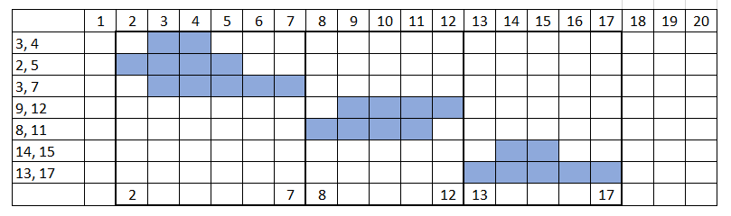
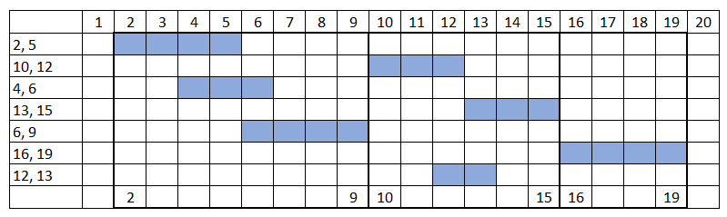
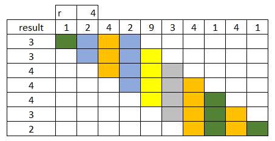
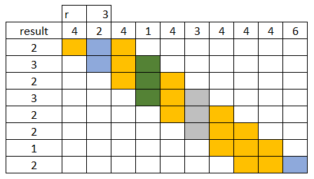
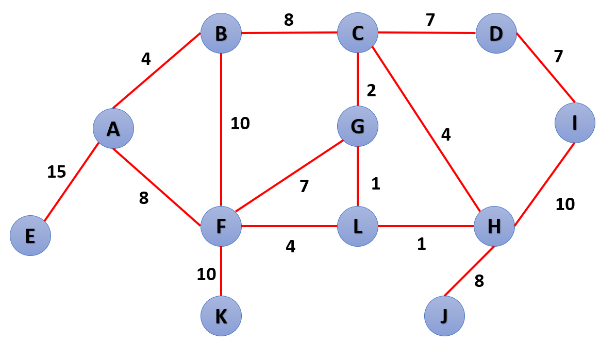

# Task #SPC 3: Simulacro PC 3  
**course:** Programación III  
**unit:** 6  
**cmake project:** prog3_simulacro_pc3_v2022_1
## Indicaciones Específicas
- El tiempo límite para la evaluación es 100 minutos.
- Cada pregunta deberá ser respondida en un archivo fuente (`.cpp`) y un archivo cabecera (`.h`) con el número de la pregunta:
    - `P1.cpp, P1.h`
    - `P2.cpp, P2.h`
    - Archivo MS Word o en cualquier archivo que incluya la imagen de lo desarrollado.
- Deberás subir estos archivos directamente a [www.gradescope.com](https://www.gradescope.com) o se puede crear un `.zip` que contenga todos ellos y subirlo.

## Question #1 - stack (7 points)

Dada una colección de rangos, desarrollar una función genérica `cluster_range` que permita generar una colección de intervalos luego de unir aquellos intervalos que se superponen. La colección generada debe ser un container del tipo `std::vector` por defecto, pero puede ser personalizado como en el ejemplo #1.

Ejemplo #1:
**Use Case:**
```cpp
deque<pair<int, int>> dq { 
      {3, 4}, 
      {2, 5},
      {3, 7},
      {9, 12},
      {8, 11},
      {14, 15},
      {13, 17},
    };
deque<pair<int, int>> result = cluster_range<deque>(begin(dq), end(dq));
for (auto [a, b] : result)     
    cout << "{"<< a << ", " << b << "} "; //  {2, 7} {8, 12} {13, 17}
cout << endl;
```


Ejemplo #2:
**Use Case:**
```cpp
vector<pair<int, int>> vc { 
      {2, 5},
      {10, 12},
      {4, 6},
      {13, 15},
      {6, 9},
      {16, 19},
      {12, 13},
    };

// cluster_range retorna un container std::vector por defecto
auto result = cluster_range(begin(vc), end(vc));
for (auto [a, b] : result)     
    cout << "{"<< a << ", " << b << "} "; // {2, 9} {10, 15} {16, 19}
cout << endl;
```


## Question #2 - hash  (7 points)

Dada una colección de valores y un número entero `r` que represente el tamaño del rango a procesar, desarrollar la función `count_distinct` que retorne para cada rango la cantidad de valores distintos en una colección de datos. La colección generada debe ser un container del tipo `std::vector` por defecto, pero puede ser personalizado como en el ejemplo #2

### Ejemplo #1
**Use Case:**
```cpp
vector<int> vc {1, 2, 4, 2, 9, 3, 4, 1, 4, 1};
int r = 4;

// count_distinct retorna un container std::vector por defecto
vector<int> result = count_distinct(begin(vc), end(vc), r);

for (auto item : result)     
    cout << item << " "; // 3 3 4 4 4 3 2
cout << endl;
```


### Ejemplo #2
**Use Case:**
```cpp
list<int> ls {4, 2, 4, 1, 4, 3, 4, 4, 4, 6};
int r = 3;

list<int> result = count_distinct<list>(begin(ls), end(ls), r);

for (auto item : result)     
    cout << item << " "; // 2 3 2 3 2 2 1 2 
cout << endl;
```


## Question #3 - Algoritmos de grafos BFS, DFS, Prim y Kruskal (6 points)

Basado en la imagen, ubicar los árboles expandidos generados de los algoritmos BFS, DFS, Prim y Kruskal y para cada caso determinar la longitud total de la ruta que permita recorrer todos los nodos del grafo.

**NOTA: Para los casos de BFS, DFS y Prim empezar de cualquier nodo**



